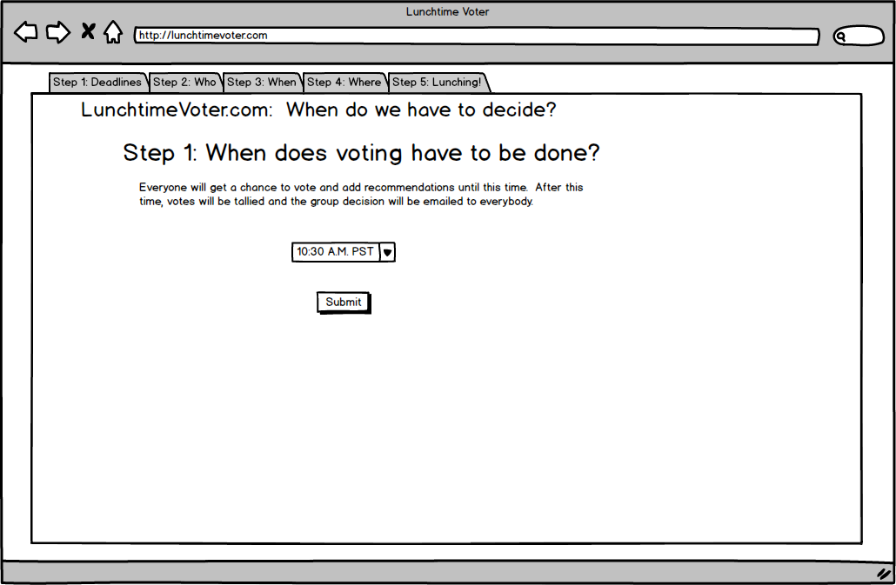
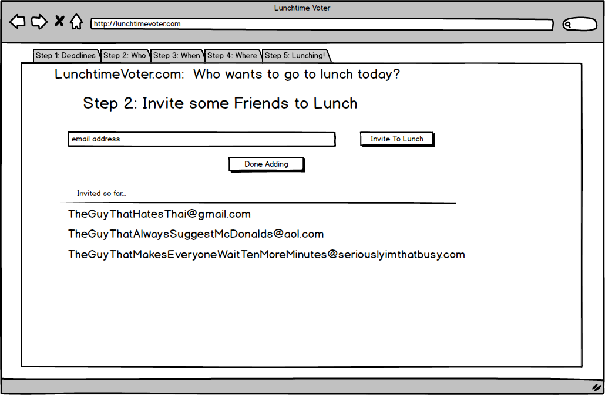
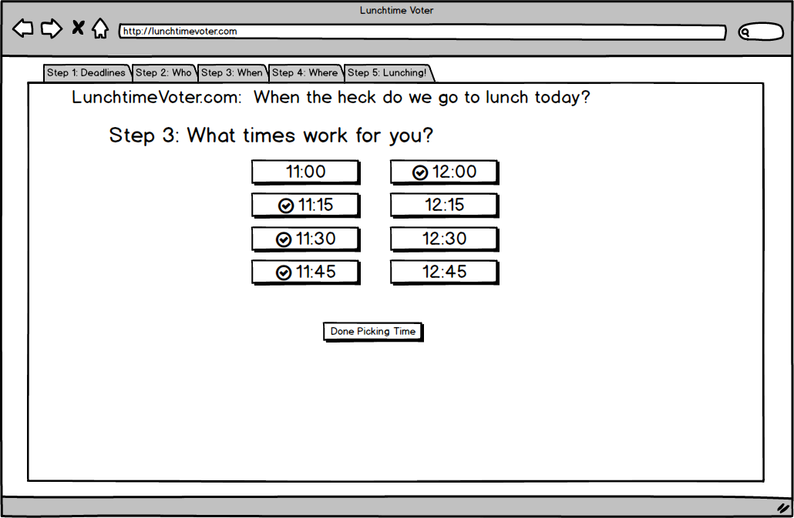
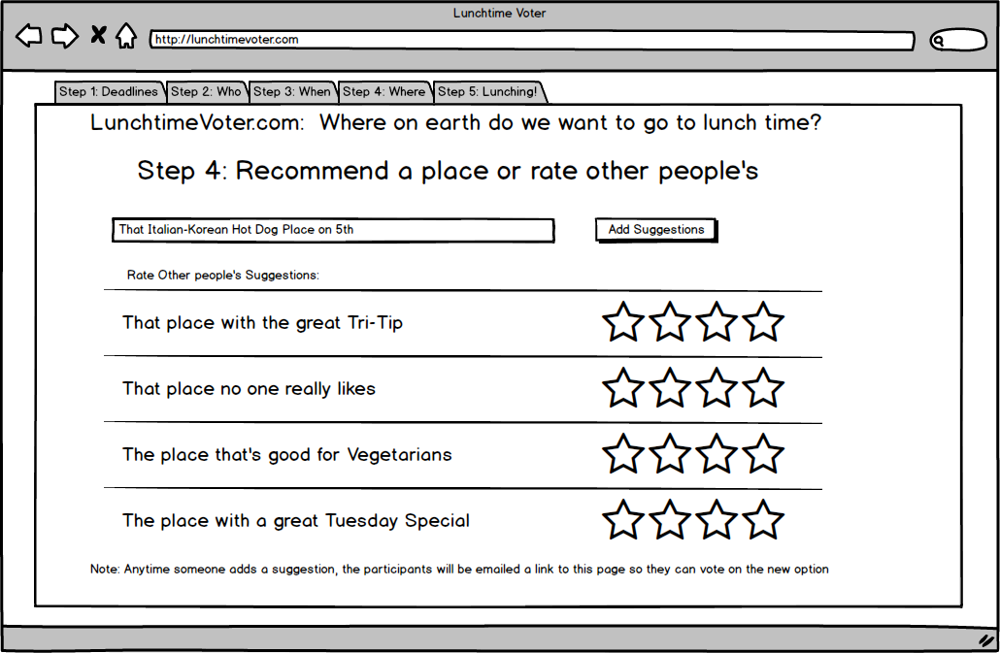
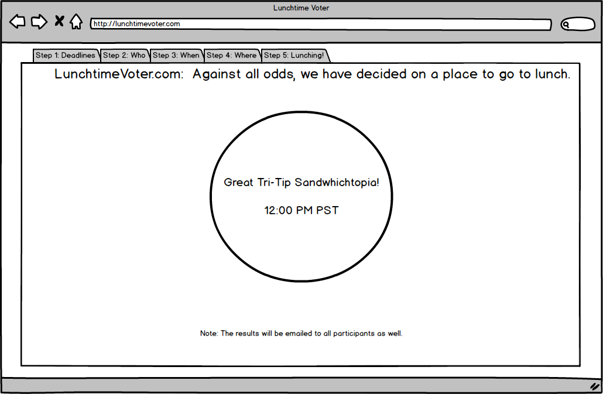

# Overview

Lunchtime Voter is a primarily two things - fun project for teams and weekend exploration of bleeding edge technologies <echo>OF THE FUTURE</echo>.

## Technologies

* Typescript as web client language
* Angular 2 as framework
* Firebase as database
* Possibly Materialize.css as CSS framework?  I can't find a lot that really works well with Angular 2 just yet.

### Possible Future Technologies

* Ionic 2 Hybrid Apps
* Swift 2.0 iOS apps
* Android Studio based Android Apps (Java 7, newest OS, etc)

## The App

The app idea itself is basically a tool for people to figure out where to go to lunch together.  
Pretty much everywhere I've ever worked, this primarily involved emailing or messaging 20 people about a hundred times:
"Do you want to go here?"  "Not Really, how bout here." "Not Really.  Anywhere but there" and so on.  Most of you
will know what I'm talking about :)  So this is just a quick way to get together and make a decision.  

Everyone gets to submit one idea for lunch. Everyone else votes on an idea.  The idea with the highest common point total wins,
and the group goes there for lunch.

### Prototype Idea Pics

## Contributing

Everyone is welcome to commit towards this primary goal.  Design changes will be voted on my active commiters.

### Contributing Bugs

Done through github issues

### Chatting.

Done through Slack.  Link TBD.

### Contributing Code

Github pull requests. 

### Contributing BBQ and/or Bubble Tea.

I will definitely come to your house anytime.
